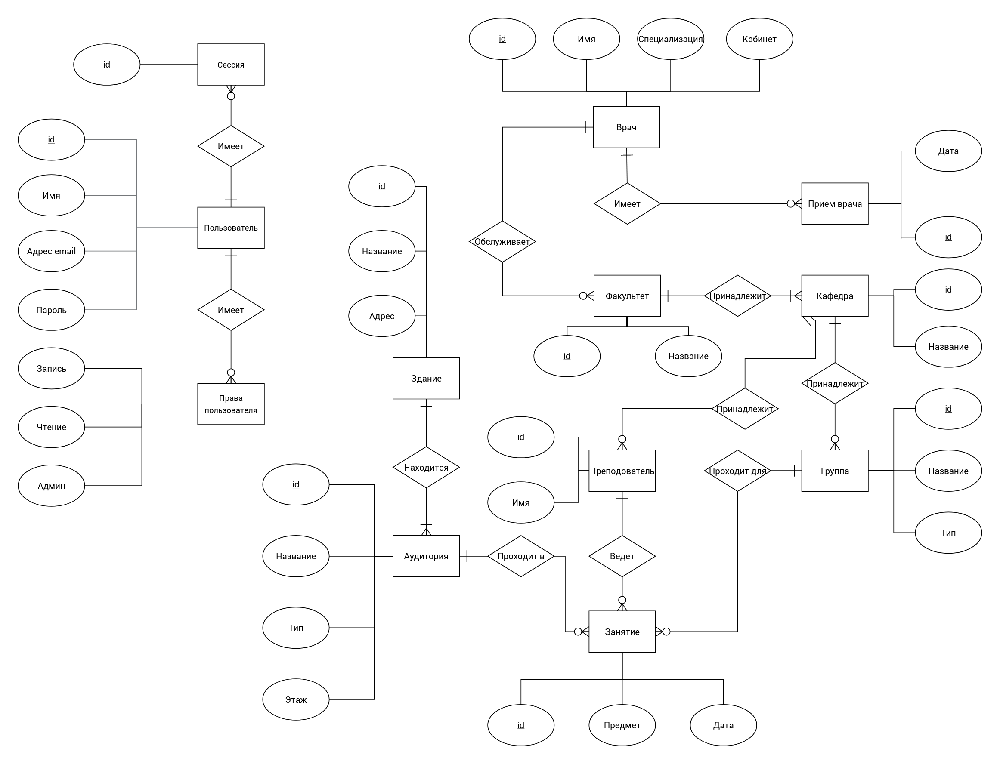

# Marusya Bauman Schedule Skill

## API
Swagger api spec - https://app.swaggerhub.com/apis/RyazMax/BaumanBotApi/1.0.0

## Установка и запуск api

Установка зависимостей

```bash
pip3 install -r swagger_server/requirements.txt
```

Запуск

```bash
python3 -m swagger_server
```

## Запуск в докере

```bash
docker-compose up
```

* 80, 443 - nginx
* 4040 - api
* 2281 - Коннектор Маруси
* 5432 - postgresql

## Структура проекта

* chatbot - чат бот - осуществляет "понимание" входящих запросов
* marusya - web-приложение, получающее запросы от сервисов Маруси
* swagger_server - api - к базе с расписанием
* nginx - конфигурация nginx

# ЛР 1

## ER диаграмма



## Нагрузочное тестирование

### 1 инстанс

```
Concurrency Level:      5
Time taken for tests:   52.306 seconds
Complete requests:      10000
Failed requests:        0
Non-2xx responses:      10000
Total transferred:      4450000 bytes
HTML transferred:       2510000 bytes
Requests per second:    191.18 [#/sec] (mean)
Time per request:       26.153 [ms] (mean)
Time per request:       5.231 [ms] (mean, across all concurrent requests)
Transfer rate:          83.08 [Kbytes/sec] received

Connection Times (ms)
              min  mean[+/-sd] median   max
Connect:        0    0   0.2      0       6
Processing:     6   26   5.9     26      72
Waiting:        6   26   5.9     26      72
Total:          6   26   5.9     26      72

Percentage of the requests served within a certain time (ms)
  50%     26
  66%     28
  75%     29
  80%     30
  90%     33
  95%     35
  98%     39
  99%     43
 100%     72 (longest request)
 ```

 ### 5 инстансов

```bash
Document Path:          /api/v1/week
Document Length:        205 bytes

Concurrency Level:      5
Time taken for tests:   14.850 seconds
Complete requests:      10000
Failed requests:        0
Non-2xx responses:      10000
Total transferred:      3870000 bytes
HTML transferred:       2050000 bytes
Requests per second:    673.42 [#/sec] (mean)
Time per request:       7.425 [ms] (mean)
Time per request:       1.485 [ms] (mean, across all concurrent requests)
Transfer rate:          254.50 [Kbytes/sec] received

Connection Times (ms)
              min  mean[+/-sd] median   max
Connect:        0    0   0.1      0       4
Processing:     2    7   3.5      6      32
Waiting:        2    7   3.5      6      31
Total:          2    7   3.5      6      32

Percentage of the requests served within a certain time (ms)
  50%      6
  66%      8
  75%      9
  80%     10
  90%     12
  95%     14
  98%     17
  99%     19
 100%     32 (longest request)
 ```